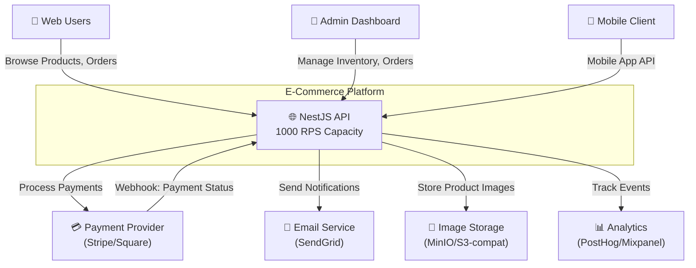
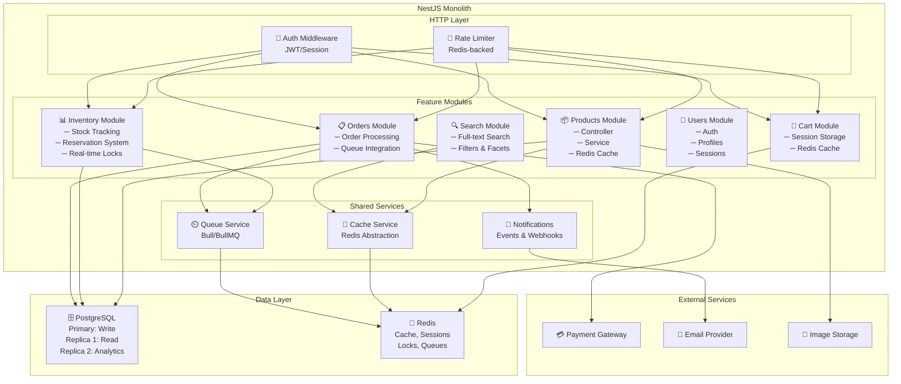
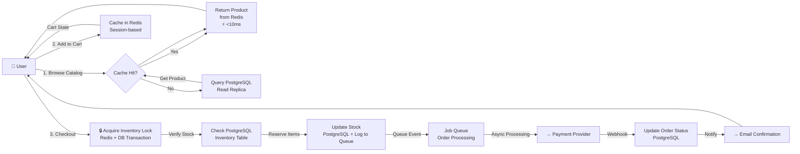
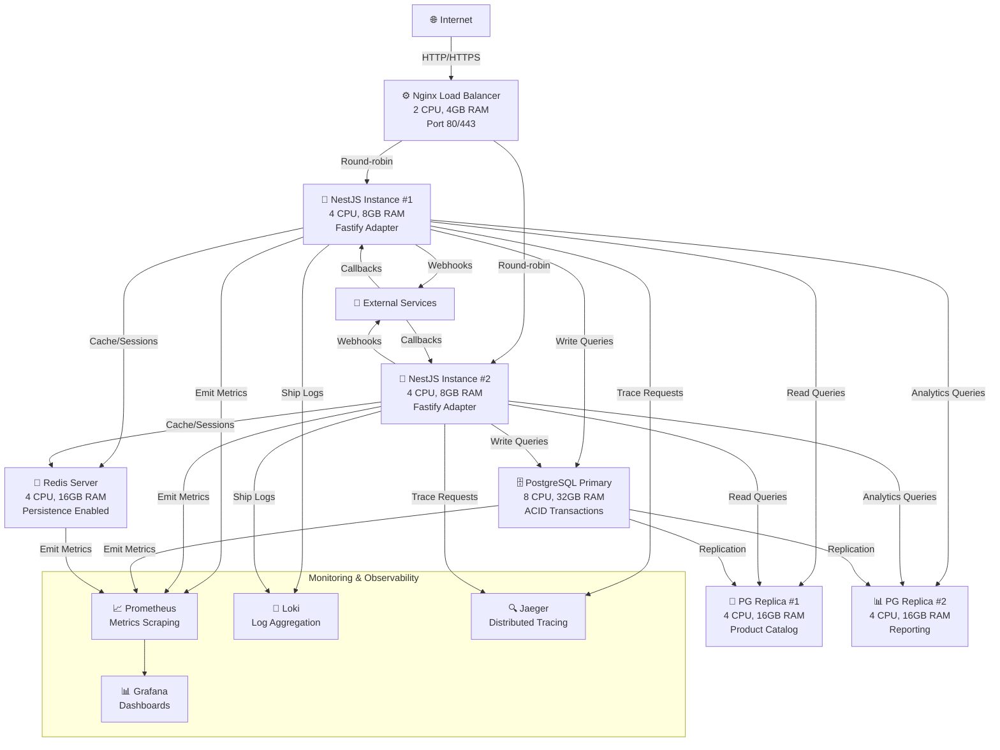

# E-Commerce Platform — Architecture Plan

## Executive Summary

A **self-hosted NestJS monolith** optimized for **1k RPS sustained load** with emphasis on **product catalog speed** and **accurate inventory management**. The architecture leverages PostgreSQL for transactional data integrity and Redis for high-speed caching and session management. Third-party payment processor handles checkout, reducing complexity. Designed for a small team (2 backend, 1 frontend) with room to scale to microservices as the team grows.

---

## Discovery Summary

| Aspect | Details |
|--------|---------|
| **Target Scale** | 1k RPS sustained, 10k monthly active users |
| **Deployment** | Self-hosted infrastructure, single region (expandable) |
| **Architecture Pattern** | NestJS Monolith with modular feature structure |
| **Data Stack** | PostgreSQL + Redis |
| **Payment** | Third-party processor (Stripe, Square, etc.) |
| **Team** | 2 backend engineers, 1 React frontend developer |
| **Critical Path** | Product catalog speed (millisecond p99 latency) |
| **Secondary Priority** | Accurate, real-time inventory tracking |
| **Read/Write Ratio** | ~70% reads (catalog, search, product details), 30% writes (orders, inventory updates, user actions) |

---

## Architecture Style

### Recommended: **Modular Monolith (NestJS)**

#### Rationale
- **Team fit**: You're already using NestJS; two backend engineers can manage a monolith comfortably
- **Simplicity**: Single deployment, shared database, no network latency between features
- **Speed to market**: All business logic in one codebase, easier to debug and test
- **1k RPS is manageable**: With proper caching (Redis), a monolith can handle 1k RPS easily
- **Clear migration path**: When you outgrow it (10k+ RPS, larger team), extract microservices

#### Architecture Principles
1. **Feature-based modules** (products, orders, users, inventory, cart) — each with controller, service, DTOs
2. **Horizontal scaling** via load balancing (multiple monolith instances behind nginx)
3. **Heavy use of Redis** for:
   - Product catalog caching (cache-aside pattern)
   - Session/cart management
   - Real-time inventory locks during checkout
   - Rate limiting and API quotas
4. **PostgreSQL optimization**:
   - Read replicas for catalog queries
   - Connection pooling
   - Proper indexing for inventory and order queries
5. **Async background jobs** (Bull/BullMQ) for:
   - Order processing
   - Inventory sync with third-party systems
   - Notifications and emails

#### Trade-offs
| Pro | Con |
|-----|-----|
| Single deployment; no service discovery complexity | Hard to scale independent features past 10k RPS |
| Easier debugging and local development | Database becomes bottleneck at very high scale |
| Rapid feature delivery | Requires discipline to avoid circular dependencies |
| Lower infrastructure overhead for small team | Redeployment affects entire system |

---

## Technology Stack

### Evaluation Matrix

| Layer | Criterion | Score | Notes |
|-------|-----------|-------|-------|
| **Backend** | | | |
| NestJS | Team Fit | 5/5 | Already using; familiar patterns |
| | Ecosystem | 5/5 | Rich middleware, pipes, guards ecosystem |
| | Scalability | 4/5 | Monolith can do 1k RPS with proper caching |
| | Performance | 4/5 | Node.js overhead, mitigated by Redis caching |
| **Database** | | | |
| PostgreSQL | Team Fit | 5/5 | Industry standard, proven reliability |
| | Scalability | 4/5 | Read replicas handle scale; no sharding needed yet |
| | ACID Compliance | 5/5 | Critical for inventory accuracy |
| | Cost | 5/5 | Self-hosted = low cost |
| **Caching** | | | |
| Redis | Performance | 5/5 | Millisecond latencies for product cache hits |
| | Simplicity | 5/5 | Single data store, no complex protocols |
| | Cost | 5/5 | Low memory footprint at 1k RPS scale |
| **Job Queue** | | | |
| Bull/BullMQ | Simplicity | 5/5 | Redis-backed; no additional infrastructure |
| | Reliability | 4/5 | Handles retries, persistence via Redis |
| **Frontend** | | | |
| React | Team Fit | 5/5 | You have a React developer |
| | Performance | 5/5 | Client-side rendering + caching |
| | Ecosystem | 5/5 | Next.js for SSR if needed later |

### Recommended Stack

#### **Backend**
```
NestJS 10.x (TypeScript)
├── Fastify adapter (faster than Express)
├── TypeORM or Prisma for database access
├── Bull/BullMQ for job queues
├── Redis client (ioredis)
├── Passport.js for authentication
└── Joi/class-validator for input validation
```

**Why Fastify over Express?** — 2–3x faster, better memory efficiency, crucial at 1k RPS

#### **Database**
```
PostgreSQL 15+
├── Primary (write-heavy: orders, inventory, users)
├── Read Replica #1 (product catalog queries)
└── Read Replica #2 (analytics/reporting)
```

#### **Caching & Sessions**
```
Redis 7.x
├── Product catalog cache (TTL-based)
├── User sessions (session store)
├── Shopping carts (temporary storage)
├── Real-time inventory locks
└── Rate limiting counters
```

#### **Frontend**
```
React 18 + TypeScript
├── Next.js for SSR (optional, product pages need fast first load)
├── TanStack Query for data fetching
├── Tailwind CSS for styling
└── Zustand or Context API for state
```

#### **Deployment & Infrastructure (Self-Hosted)**
```
Compute:
├── 2x Application Servers (NestJS instances, ≥4 CPU, 8GB RAM each)
├── 1x Nginx Load Balancer (2 CPU, 4GB RAM)
├── 1x PostgreSQL Primary (8 CPU, 32GB RAM)
├── 2x PostgreSQL Read Replicas (4 CPU, 16GB RAM each)
└── 1x Redis Server (4 CPU, 16GB RAM — can expand to cluster)

Networking:
├── Private VPC/subnet for database and Redis
├── Public subnet for load balancer
└── Monitoring: Prometheus + Grafana, ELK stack or Loki for logs

Storage:
├── SSD-backed volumes for PostgreSQL (≥500GB initial)
└── S3-compatible object storage for product images
```

---

## System Architecture

### System Context Diagram



### Component Architecture Diagram



### Data Flow Diagram



### Deployment Diagram



---

## Database Strategy: PostgreSQL Optimization for 1k RPS

### Schema Design

```sql
-- Core tables with indexing for 1k RPS

CREATE TABLE users (
    id UUID PRIMARY KEY,
    email VARCHAR(255) UNIQUE NOT NULL,
    password_hash VARCHAR(255) NOT NULL,
    created_at TIMESTAMP DEFAULT NOW(),
    updated_at TIMESTAMP DEFAULT NOW(),
    INDEX idx_email (email),
    INDEX idx_created_at (created_at)
);

CREATE TABLE products (
    id UUID PRIMARY KEY,
    sku VARCHAR(100) UNIQUE NOT NULL,
    name VARCHAR(255) NOT NULL,
    description TEXT,
    price DECIMAL(10, 2) NOT NULL,
    category_id UUID,
    tags JSONB,  -- For filtering
    metadata JSONB,  -- For caching context
    created_at TIMESTAMP DEFAULT NOW(),
    updated_at TIMESTAMP DEFAULT NOW(),
    INDEX idx_sku (sku),
    INDEX idx_category_id (category_id),
    INDEX idx_tags (tags),  -- GIN index for JSONB
    INDEX idx_created_at (created_at),
    INDEX idx_price (price)
);

CREATE TABLE inventory (
    id UUID PRIMARY KEY,
    product_id UUID NOT NULL REFERENCES products(id),
    quantity INT NOT NULL DEFAULT 0,
    reserved INT NOT NULL DEFAULT 0,  -- For pending orders
    warehouse_id UUID,
    last_updated TIMESTAMP DEFAULT NOW(),
    UNIQUE(product_id, warehouse_id),
    INDEX idx_product_id (product_id),
    INDEX idx_warehouse_id (warehouse_id),
    INDEX idx_last_updated (last_updated)
);

CREATE TABLE orders (
    id UUID PRIMARY KEY,
    user_id UUID NOT NULL REFERENCES users(id),
    status VARCHAR(50),  -- pending, processing, shipped, delivered
    total_amount DECIMAL(10, 2) NOT NULL,
    payment_id VARCHAR(255),  -- Third-party provider ID
    created_at TIMESTAMP DEFAULT NOW(),
    updated_at TIMESTAMP DEFAULT NOW(),
    INDEX idx_user_id (user_id),
    INDEX idx_status (status),
    INDEX idx_created_at (created_at),
    INDEX idx_payment_id (payment_id)
);

CREATE TABLE order_items (
    id UUID PRIMARY KEY,
    order_id UUID NOT NULL REFERENCES orders(id),
    product_id UUID NOT NULL REFERENCES products(id),
    quantity INT NOT NULL,
    price_at_purchase DECIMAL(10, 2) NOT NULL,
    INDEX idx_order_id (order_id),
    INDEX idx_product_id (product_id)
);
```

### Query Optimization

| Operation | Pattern | Notes |
|-----------|---------|-------|
| **Product Catalog Browse** | `SELECT * FROM products WHERE category_id = $1 LIMIT 20 OFFSET $2` | ✅ Cached in Redis (TTL: 1 hour) |
| **Search** | Full-text search on `name, description` | Use `tsvector` index or PostgreSQL FTS |
| **Inventory Check** | `SELECT quantity - reserved FROM inventory WHERE product_id = $1` | ✅ Cached for 10 seconds, refreshed on order |
| **Order History** | `SELECT * FROM orders WHERE user_id = $1 ORDER BY created_at DESC` | ✅ Read from replica, paginate |
| **Real-time Inventory Lock** | `BEGIN; SELECT * FROM inventory FOR UPDATE; UPDATE quantity...;` | Strong consistency for accuracy |

### Read Replicas Strategy

```
Primary (WRITE ONLY):
  ├─ Orders (INSERT/UPDATE/DELETE)
  ├─ Inventory updates (transactions)
  └─ User writes

Replica #1 (PRODUCT CATALOG):
  ├─ Product searches
  ├─ Category browsing
  └─ Product details
  
Replica #2 (ANALYTICS/REPORTING):
  ├─ Sales reports
  ├─ User behavior analytics
  └─ Dashboard queries
```

---

## Caching Strategy: Redis Patterns for Product Speed

### Cache Layers

```
Layer 1: Browser Cache (HTTP Headers)
├─ Products: Cache-Control: public, max-age=3600
├─ Images: Cache-Control: public, max-age=31536000
└─ Static: Cache-Control: public, max-age=86400

Layer 2: Redis Server Cache (Shared)
├─ Product catalog (key: "product:{id}", TTL: 1 hour)
├─ Category listings (key: "category:{id}:products", TTL: 30 min)
├─ Search results (key: "search:{query}:{page}", TTL: 10 min)
├─ User sessions (key: "session:{sessionId}", TTL: 7 days)
├─ Shopping carts (key: "cart:{userId}", TTL: 30 days)
└─ Inventory snapshots (key: "inventory:{productId}", TTL: 10 sec)

Layer 3: Application Memory Cache
├─ Category tree (rebuilt hourly)
└─ Feature flags (refreshed every 5 min)
```

### Redis Key Patterns

```typescript
// Product cache (Cache-Aside pattern)
const getProduct = async (productId: string) => {
  const cached = await redis.get(`product:${productId}`);
  if (cached) return JSON.parse(cached);
  
  const product = await db.query('SELECT * FROM products WHERE id = ?', [productId]);
  await redis.setex(`product:${productId}`, 3600, JSON.stringify(product));
  return product;
};

// Inventory lock (Distributed lock with Redis)
const reserveInventory = async (productId: string, quantity: number) => {
  const lock = await redis.set(
    `inventory:lock:${productId}`,
    Date.now(),
    'EX', 5, // 5 second lock
    'NX'  // Only set if not exists
  );
  
  if (!lock) throw new Error('Inventory locked, try again');
  
  // Check inventory and reserve atomically
  const result = await db.transaction(async (trx) => {
    const inventory = await trx.query(
      'SELECT quantity - reserved FROM inventory WHERE product_id = ?',
      [productId]
    );
    if (inventory.available < quantity) throw new Error('Out of stock');
    
    return await trx.query(
      'UPDATE inventory SET reserved = reserved + ? WHERE product_id = ?',
      [quantity, productId]
    );
  });
  
  await redis.del(`inventory:lock:${productId}`);
  return result;
};

// Session cache
const getSession = async (sessionId: string) => {
  return await redis.getObject(`session:${sessionId}`);
};
```

### Cache Invalidation Strategy

| Event | Action |
|-------|--------|
| Product created/updated | `redis.del("product:{id}")` + `redis.del("category:{categoryId}:products")` |
| Inventory updated | `redis.del("inventory:{productId}")` |
| Price changed | `redis.del("product:{id}")` |
| Category modified | `redis.del("category:{categoryId}:products")` + invalidate search |

---

## Job Queue: Order Processing with BullMQ

### Queue Jobs

```typescript
// Order Processing Queue
const orderQueue = new Queue('orders', {
  connection: redis,
  defaultJobOptions: {
    attempts: 3,
    backoff: { type: 'exponential', delay: 2000 },
    removeOnComplete: true
  }
});

// Job 1: Send order confirmation email
orderQueue.process('order-confirmation', async (job) => {
  const { orderId, email } = job.data;
  await emailService.sendOrderConfirmation(email, orderId);
});

// Job 2: Update inventory sync
orderQueue.process('inventory-sync', async (job) => {
  const { productId, quantity } = job.data;
  await thirdPartyInventorySystem.sync(productId, quantity);
});

// Job 3: Webhook notification
orderQueue.process('webhook-notify', async (job) => {
  const { webhookUrl, orderData } = job.data;
  await axios.post(webhookUrl, orderData);
});
```

---

## Scalability Roadmap

### Phase A: MVP (0–200 RPS) — Foundation
- 1x NestJS instance
- 1x PostgreSQL primary
- 1x Redis instance
- Basic monitoring

**Timeline**: Launch → Month 3
**Focus**: Get product queries under 50ms p99

### Phase B: Growth (200–500 RPS) — Read Scaling
- 2x NestJS instances + Nginx load balancer
- PostgreSQL primary + 1 read replica
- Redis persistence enabled
- Job queue for async processing

**Timeline**: Month 3 → Month 6
**Changes**: Add read replica, introduce caching layer
**Cost increase**: ~40%

### Phase C: Scale (500–1k RPS) — Full Optimization
- 3–4x NestJS instances
- PostgreSQL primary + 2 read replicas
- Redis cluster (sharding)
- Advanced monitoring + alerting

**Timeline**: Month 6 → Month 12
**Changes**: Redis cluster, second replica, application optimization
**Cost increase**: ~30% more

### Phase D: Beyond (1k+ RPS) — Microservices
- Extract inventory service (separate database)
- Extract search service (Elasticsearch)
- Extract order processing (Event-driven queue)
- Grow team: Plan for more engineers

---

## Cost Analysis: Self-Hosted Infrastructure

### Hardware Requirements & Costs

Assuming monthly cost (12-month amortized commitment):

| Phase | Component | Specs | Monthly Cost* |
|-------|-----------|-------|--------------|
| **MVP** | App Server | 2 CPU, 4GB RAM | $40 |
| | PostgreSQL | 4 CPU, 8GB RAM | $80 |
| | Redis | 2 CPU, 4GB RAM | $40 |
| | Network/Storage | 100GB SSD, 1Gbps | $30 |
| | **MVP Total** | | **$190** |
| **Growth** | App Servers (×2) | 2× (4 CPU, 8GB) | $120 |
| | Load Balancer | 2 CPU, 4GB RAM | $40 |
| | PostgreSQL Primary | 8 CPU, 32GB RAM | $200 |
| | PostgreSQL Replica | 4 CPU, 16GB RAM | $100 |
| | Redis | 4 CPU, 16GB RAM | $100 |
| | Network/Storage | 500GB SSD, 2Gbps | $80 |
| | **Growth Total** | | **$640** |
| **Scale (1k RPS)** | App Servers (×4) | 4× (4 CPU, 8GB) | $240 |
| | Load Balancer | 4 CPU, 8GB RAM | $60 |
| | PostgreSQL Primary | 8 CPU, 32GB RAM | $200 |
| | PostgreSQL Replicas (×2) | 2× (4 CPU, 16GB) | $200 |
| | Redis Cluster | 3 nodes (4 CPU, 16GB each) | $300 |
| | Network/Storage | 1TB SSD, 10Gbps | $150 |
| | Monitoring Stack | Prometheus, Grafana, Loki | $100 |
| | **Scale Total** | | **$1,250** |

*Costs assume server hosting provider (Hetzner, OVH, Linode). For AWS equivalent with on-demand pricing, multiply by 1.5–2x.

### Cost Optimization Strategies

1. **Reserved Instances** (12-month commitment): Save 30–40% vs on-demand
2. **Use ARM-based servers** (Graviton, Apple Silicon clones): Save 20% on compute
3. **Compress images**: Reduce storage bandwidth by 50%
4. **Redis memory optimization**: Use compression for cache values
5. **Database connection pooling**: Reduce connection overhead by 60%

### Self-Hosted vs Cloud Comparison

| Metric | Self-Hosted | AWS | GCP |
|--------|-------------|-----|-----|
| **Monthly Cost (1k RPS)** | $1,250 | $2,500–3,000 | $2,200–2,800 |
| **Operational Overhead** | High | Low | Low |
| **Scalability Agility** | Medium | High | High |
| **Team Size to Manage** | 1 DevOps | 0.25 DevOps | 0.25 DevOps |
| **Break-even Point** | ~500 RPS | ~100 RPS | ~150 RPS |

**Recommendation**: Self-hosted is **30% cheaper** at 1k RPS, but requires DevOps expertise. At your scale with a small team, cloud (AWS/GCP) may be better ROI unless you have experienced DevOps.

---

## Best Practices for E-Commerce

### Product Catalog

```
✅ Cache hot products (top 10% by views)
✅ Denormalize: Embed category in product doc for faster filtering
✅ Implement ETags for conditional GET requests
✅ Use CDN for product images (CloudFront, Cloudflare, or Bunny)
✅ Search: Use PostgreSQL full-text search for MVP; migrate to Elasticsearch at 1k+ products
```

### Inventory Management

```
✅ Real-time accuracy: Use distributed locks (Redis) + database transactions
✅ Reserve inventory during checkout, not before
✅ Implement backorder logic if selling pre-orders
✅ Sync with third-party inventory systems via async jobs
✅ Handle race conditions: Test with concurrent orders
```

### Shopping Cart

```
✅ Store in Redis (session-based or user ID keyed)
✅ Implement TTL: 30 days (persistent carts)
✅ Validate prices at checkout (don't trust cached prices)
✅ Show real-time inventory in cart (< 500ms)
```

### Orders & Payments

```
✅ Idempotent payment requests (use idempotency keys)
✅ Handle webhook retries from payment processor
✅ Store payment transaction ID as foreign key
✅ Process orders asynchronously (don't block checkout)
✅ Implement state machine: pending → processing → shipped → delivered
```

### Performance Optimization

```
✅ API Response Targets:
   - Product list: <50ms p99
   - Product detail: <100ms p99
   - Search: <200ms p99
   - Checkout: <500ms p99
   
✅ Batch API responses (N+1 prevention)
✅ Use database-level aggregations for reports
✅ Implement pagination (cursor-based for large result sets)
✅ Compress responses (gzip, Brotli)
```

---

## Security Architecture

### Authentication & Authorization

```
✅ JWT tokens with 15-min expiry
✅ Refresh tokens stored in Redis (revocable)
✅ Session-based auth for web, OAuth2 for mobile (optional)
✅ Role-based access control (RBAC): Admin, Seller, Customer
✅ Rate limiting: 100 requests/min per user, 1000/min per IP
```

### Payment Security (PCI-DSS Compliance)

```
✅ Never store card data; use third-party processor (Stripe, Square)
✅ Use tokenized payment: Send token, not card details
✅ Implement HTTPS everywhere (TLS 1.3 minimum)
✅ Webhook signature validation: Verify payment processor identity
✅ Audit logging: Track all payment-related events
```

### Data Protection

```
✅ Database encryption at rest (dm-crypt, LUKS)
✅ Encrypted backups to separate storage
✅ Implement database user privileges (read-only for replicas)
✅ Secrets management: Store Redis password, DB credentials in secrets manager
✅ Regular security audits and penetration testing
```

### API Security

```
✅ Input validation: Use DTOs with class-validator
✅ SQL injection prevention: Use parameterized queries (TypeORM/Prisma)
✅ CORS: Restrict to known origins
✅ CSRF protection: For state-changing operations
✅ Brute-force protection: Rate limiting + IP blocking after N failed attempts
```

---

## Risks & Mitigations

| Risk | Probability | Impact | Mitigation |
|------|-------------|--------|-----------|
| **Database becomes bottleneck** | Medium | Critical | Read replicas, caching layer, query optimization |
| **Redis cache failure** | Medium | High | Persistence enabled, automatic failover, graceful degradation |
| **Inventory data inconsistency** | Low | Critical | Distributed locks, ACID transactions, audit logging |
| **Payment webhook delivery failure** | Medium | High | Implement webhook retry logic, idempotency keys, reconciliation job |
| **Traffic spike (flash sale)** | Medium | High | Load testing, auto-scaling (if using cloud), rate limiting, queue prioritization |
| **Small team burnout** | High | Critical | Automate monitoring, implement alerting, clear runbooks, documentation |
| **Third-party payment downtime** | Low | Critical | Fallback payment method, queue orders during outage, retry logic |

---

## Implementation Roadmap

### Phase 1: Foundation (Weeks 1–4)
- [ ] Set up PostgreSQL schema with indexes
- [ ] Implement NestJS modules: Users, Products, Orders, Cart
- [ ] Add Redis caching layer for products
- [ ] Integrate third-party payment processor
- [ ] Deploy with Nginx load balancer (1 backend instance)

### Phase 2: Optimization (Weeks 5–8)
- [ ] Add read replica for PostgreSQL
- [ ] Implement BullMQ for async jobs
- [ ] Optimize database queries (add missing indexes)
- [ ] Set up monitoring: Prometheus + Grafana
- [ ] Load test to 200 RPS

### Phase 3: Scale (Weeks 9–12)
- [ ] Deploy second NestJS instance
- [ ] Add inventory reservation system
- [ ] Implement Redis persistence + RDB backups
- [ ] Set up log aggregation (Loki)
- [ ] Load test to 500 RPS

### Phase 4: Production Hardening (Weeks 13–16)
- [ ] Add third read replica
- [ ] Implement distributed tracing (Jaeger)
- [ ] Security audit: OWASP Top 10
- [ ] Disaster recovery: Backup & restore procedures
- [ ] Load test to 1k RPS

---

## Monitoring & Observability

### Key Metrics to Track

```
Application:
├─ Request latency (p50, p95, p99)
├─ Requests per second (RPS)
├─ Error rate (4xx, 5xx)
├─ Cache hit ratio (aim for >90%)
└─ Job queue depth

Database:
├─ Query latency (p99)
├─ Connections (current vs max)
├─ Replication lag
├─ Transaction abort rate
└─ Slow query log (>100ms)

Infrastructure:
├─ CPU utilization
├─ Memory usage
├─ Disk I/O
├─ Network throughput
└─ Container restart count
```

### Alerting Rules

```
Critical (PagerDuty):
├─ Error rate > 5% for 5 min
├─ API latency p99 > 1s for 10 min
├─ Database replication lag > 10s
└─ Disk usage > 85%

Warning (Email/Slack):
├─ Cache hit ratio < 70%
├─ Job queue depth > 10,000
├─ Memory usage > 80%
└─ API latency p95 > 500ms
```

---

## Next Steps

1. **Week 1**: Review this architecture with team; adjust as needed
2. **Week 1–2**: Begin Phase 1 implementation (Foundation)
3. **Week 3**: Load testing framework setup
4. **Week 4**: Soft launch to internal users
5. **Week 5**: Go-live monitoring and observability setup
6. **Weeks 6+**: Begin Phase 2 (Optimization)

---

## Links & Resources

- **Architecture Diagrams**: [View Interactive Diagrams](./ecommerce-architecture-diagrams.html)
- **Draw.io Editable**: [Edit in Draw.io](./ecommerce-architecture.drawio)
- **Individual Diagrams**: See `docs/diagrams/` folder

